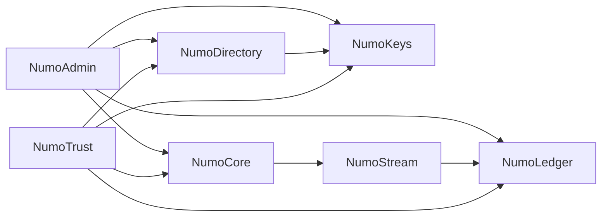
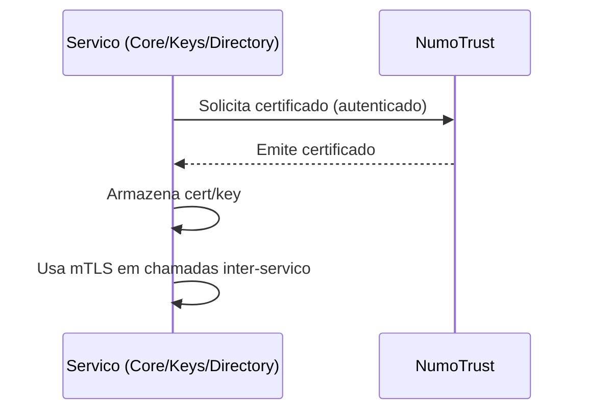
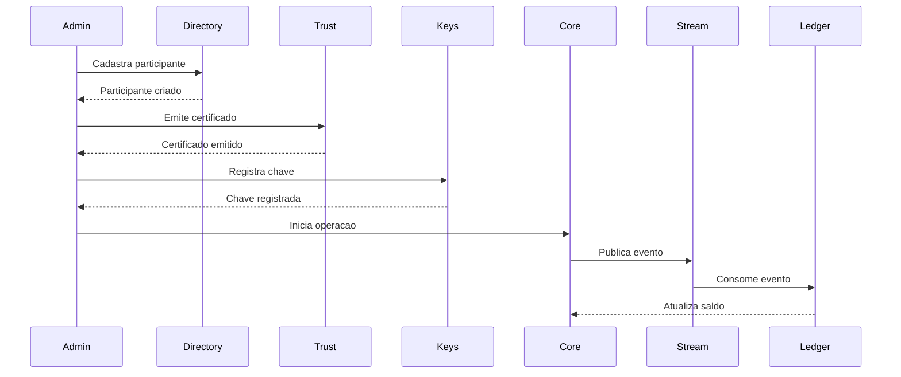

## Arquitetura

### Visao geral
O Numo e uma plataforma composta por servicos independentes que se comunicam
via HTTP e eventos. O repositorio central documenta como essas partes se
conectam, quais contratos existem e quais padroes devem ser seguidos.

### Componentes principais
- **Core**: orquestracao de operacoes e regras de negocio.
- **Directory**: registro de participantes e permissoes.
- **Keys**: gestao de chaves e validacoes.
- **Ledger**: registro de entradas, saldos e snapshots.
- **Stream**: barramento de eventos (Kafka).
- **Trust**: emissao e gestao de certificados.
- **Admin**: painel de operacao e proxy administrativo.

### Fluxo alto nivel (exemplo)
1. Participante criado no Directory.
2. Certificado emitido via Trust.
3. Chave registrada no Keys com validacao de identidade.
4. Operacoes passam pelo Core e geram eventos no Stream.
5. Ledger registra entradas e saldos com base nos eventos.

### Diagrama de contexto (alto nivel)

### Diagrama de certificados (mTLS)

### Fluxo end-to-end (cadastro -> emissao -> operacao)

### Integracao entre servicos
- **mTLS** e/ou **JWT** para autenticacao entre servicos.
- **Schemas versionados** para eventos e APIs.
- **Observabilidade** padronizada (logs/metricas/traces).

### Decisoes arquiteturais
Documente aqui (ou em `docs/decisions/`) as principais escolhas tecnicas e
trade-offs. Ex: escolha de Kafka, Postgres, padrao de certificados, etc.
