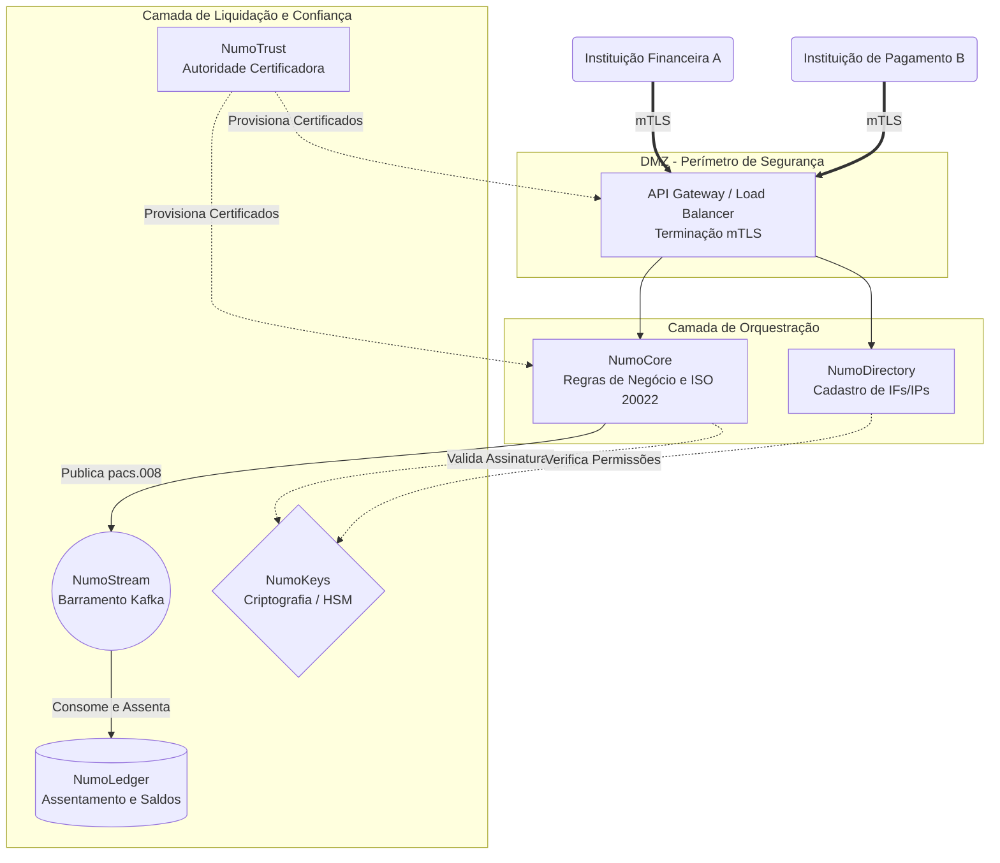

# Arquitetura Institucional do Numo (DPI)

O Numo atua como o **Nó Raiz (Root Node)** de um Sistema Financeiro Nacional. Ele é uma Infraestrutura Pública Digital (DPI) modular focada em Liquidação Bruta em Tempo Real (RTGS), projetada para ser operada por Bancos Centrais ou Entidades Reguladoras.

Ao invés de ser um monolito "caixa-preta", o Numo separa as responsabilidades estatais em microsserviços auditáveis que se comunicam via gRPC/HTTP e mensageria distribuída (Kafka), exigindo Autenticação Mútua (mTLS 1.3) em todas as camadas.

---

## 🏛 Topologia do Nó Raiz

A arquitetura foi desenhada para separar o tráfego externo (proveniente das Instituições Financeiras) do processamento interno de liquidação atômica.



### Componentes de Nível Estatal:
*   **DMZ / API Gateway**: O único ponto exposto para a internet pública (ou rede privada do SFN). Termina as conexões mTLS das instituições conectadas, impedindo varreduras internas.
*   **NumoCore**: O cérebro do RTGS. Ele *não* guarda saldos; ele valida as mensagens gramaticais de negócio (padrão ISO 20022) e orquestra se a transação pode prosseguir para pré-reserva.
*   **NumoLedger**: A fonte da verdade incontestável. Ele é um autômato de estado finito que consome eventos do barramento e efetua a trava (lock) e liquidação dos fundos atomicamente.
*   **NumoTrust & NumoKeys**: O coração de utilidade de Segurança Nacional. Garante a emissão de certificados SPIFFE para zero-trust interno e integra com Módulos de Segurança em Hardware (HSMs).

---

## ⚡ Fluxograma de Liquidação Primária (RTGS - pacs.008)

O ciclo de vida a seguir demonstra como o Estado processa uma Transferência Eletrônica de Crédito comum (ex: TED ou PIX no Brasil) que interliga dois bancos diferentes interagindo com a infraestrutura Numo. 

Utilizamos o padrão **ISO 20022**, especificamente o verbo gramatical `pacs.008` (Customer Credit Transfer).

```mermaid
sequenceDiagram
    autonumber
    
    box rgb(240, 245, 255) Participantes da Rede
    participant BankA as Instituição de Origem (Pagador)
    participant BankB as Instituição de Destino (Recebedor)
    end
    
    box rgb(240, 255, 240) Numo (Root Node)
    participant Gateway as API Gateway
    participant Core as NumoCore
    participant Stream as NumoStream
    participant Ledger as NumoLedger
    end

    Note over BankA, BankB: Ambos possuem certificados do NumoTrust
    
    BankA->>Gateway: POST /v1/transfers (Payload ISO pacs.008 via mTLS)
    Gateway->>Core: Roteia payload (Assinatura Validada)
    
    activate Core
    Core->>Core: 1. Validação Semântica (ISO 20022 Schema)
    Core->>Core: 2. Validação de Compliance (NumoDirectory)
    Core->>Stream: Envia evento: RESERVA_SALDO (BankA)
    
    activate Stream
    Stream->>Ledger: Consome evento de Reserva
    
    activate Ledger
    alt Saldo Insuficiente
        Ledger-->>Stream: Erro L100 (Insufficient Funds)
        Stream-->>Core: Fallback/Rejeição
        Core-->>BankA: Retorna pacs.002 (Rejeição Técnica)
    else Saldo Suficiente
        Ledger->>Ledger: Lock(Valor) no Account do BankA
        Ledger-->>Stream: Evento: FUNDOS_RESERVADOS
    end
    deactivate Ledger
    deactivate Stream
    
    Core->>Stream: Envia evento: SETTLE_FUNDS (BankA -> BankB)
    activate Stream
    Stream->>Ledger: Consome evento de Liquidação
    
    activate Ledger
    Ledger->>Ledger: Subtrai(BankA); Adiciona(BankB); Commit;
    Ledger-->>Stream: Evento: TRANSACAO_LIQUIDADA_COM_SUCESSO
    deactivate Ledger
    deactivate Stream
    
    Core-->>BankA: Retorna pacs.002 (Liquidação Confirmada)
    Core-)BankB: Webhook Dispatch: pacs.008 (Notificação de Recebimento)
    deactivate Core
```

### Garantias de Consistência (ACID)
O Ledger opera o padrão *Event Sourcing*. Todo movimento estatal (Débito e Crédito) nunca é um "UPDATE" direto no banco de dados, mas sim uma soma imutável de vetores lógicos anexada (append-only), permitindo ao Banco Central reconstruir o bloco e a economia de qualquer microsegundo histórico.

---

## 🔐 Integração e Segurança Contratual

Os desenvolvedores do Numo operam através dos seguintes princípios arquiteturais inegociáveis:
1. **Zero-Trust Interno**: Mesmo que um serviço esteja na rede privada (VPC do Nó Raiz), o `NumoCore` não confia no `NumoLedger` e vice-versa; ambos exigem TLS mútuo contínuo.
2. **Contratos Abertos**: Todas as APIs externas usadas pelas IFs/IPs devem ser expostas em formato OpenAPI Specification (Swagger) e/ou gRPC Proto.
3. **Imutabilidade**: Nenhum desenvolvedor (Core Tech) tem a API para "Deletar Transação" do log. Extornos (Rollbacks) em RTGS se dão através de um envio manual sub-arquitetural (mensageria `pacs.004` - Return of Funds).
